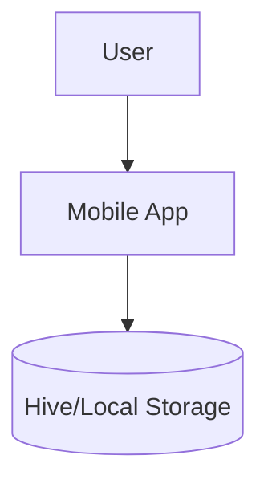

<div align="center">

# GOOD DAY
### MOOD TRACKER


<br />

**A comprehensive mood tracking application built with Flutter.**
**Track your daily mood, activities, and gain insights into your well-being.**

[Getting Started](#-getting-started) • [License](#-license)

</div>

---

## 🏗️ Architecture

Native mobile application built with **Flutter**, supporting both Android and iOS platforms.



---

## 🚀 Features

<div align="center">

| Feature | Description |
|:-------:|:----------- |
| **Mood Tracking** | Log daily moods with customizable icons. |
| **Activity Logging** | Associate activities with your moods. |
| **Insights** | Visual analytics of mood trends over time. |

</div>

---

## 🛠️ Getting Started

### Prerequisites

*   **Flutter SDK**
*   **Dart SDK**
*   **Android Studio / Xcode**

### Installation

```bash
# 1. Clone the repository
git clone https://github.com/DionathaGoulart/good_day.git

# 2. Enter the directory
cd good_day

# 3. Install dependencies
flutter pub get

# 4. Run the app
flutter run
```

---

## 📄 License

This project is proprietary and confidential.

**Copyright © 2026 Dionatha Goulart.**
All Rights Reserved.
